

```R
# loading data set
if (!require("RCurl")) install.packages("RCurl")
library(RCurl)
URL <- getURL("https://raw.githubusercontent.com/mfofanagn/Forecasting-US-national-parks-visits-/master/park_visits.csv")
visits <- read.csv(text = URL)
```

    Loading required package: RCurl
    Loading required package: bitops


```R
str(visits)
```

    'data.frame':	25587 obs. of  12 variables:
     $ ParkName        : Factor w/ 305 levels "Abraham Lincoln Birthplace NHP",..: 1 1 1 1 1 1 1 1 1 1 ...
     $ ParkType        : Factor w/ 8 levels "National Battlefield",..: 3 3 3 3 3 3 3 3 3 3 ...
     $ Region          : Factor w/ 7 levels "Alaska","Intermountain ",..: 7 7 7 7 7 7 7 7 7 7 ...
     $ State           : Factor w/ 53 levels "AK","AL","AR",..: 19 19 19 19 19 19 19 19 19 19 ...
     $ Year            : int  2010 2010 2010 2010 2010 2010 2010 2010 2010 2010 ...
     $ Month           : int  1 2 3 4 5 6 7 8 9 10 ...
     $ lat             : num  37.6 37.6 37.6 37.6 37.6 ...
     $ long            : num  -85.7 -85.7 -85.7 -85.7 -85.7 ...
     $ cost            : num  0 0 0 0 0 0 0 0 0 0 ...
     $ logVisits       : num  8.26 8.55 8.99 9.81 9.87 ...
     $ laglogVisits    : num  NA 8.26 8.55 8.99 9.81 ...
     $ laglogVisitsYear: num  NA NA NA NA NA NA NA NA NA NA ...


```R
# Manage missing and outlear values
```


```R
colSums(is.na(visits)) 
```


<dl class=dl-horizontal>
	<dt>ParkName</dt>
		<dd>0</dd>
	<dt>ParkType</dt>
		<dd>0</dd>
	<dt>Region</dt>
		<dd>0</dd>
	<dt>State</dt>
		<dd>0</dd>
	<dt>Year</dt>
		<dd>0</dd>
	<dt>Month</dt>
		<dd>0</dd>
	<dt>lat</dt>
		<dd>84</dd>
	<dt>long</dt>
		<dd>84</dd>
	<dt>cost</dt>
		<dd>0</dd>
	<dt>logVisits</dt>
		<dd>0</dd>
	<dt>laglogVisits</dt>
		<dd>305</dd>
	<dt>laglogVisitsYear</dt>
		<dd>3660</dd>
</dl>


```R
visits = visits[rowSums(is.na(visits)) == 0, ]
visits = visits[visits$logVisits != 0, ]
```


```R
str(visits)
```

    'data.frame':	21500 obs. of  12 variables:
     $ ParkName        : Factor w/ 305 levels "Abraham Lincoln Birthplace NHP",..: 1 1 1 1 1 1 1 1 1 1 ...
     $ ParkType        : Factor w/ 8 levels "National Battlefield",..: 3 3 3 3 3 3 3 3 3 3 ...
     $ Region          : Factor w/ 7 levels "Alaska","Intermountain ",..: 7 7 7 7 7 7 7 7 7 7 ...
     $ State           : Factor w/ 53 levels "AK","AL","AR",..: 19 19 19 19 19 19 19 19 19 19 ...
     $ Year            : int  2011 2011 2011 2011 2011 2011 2011 2011 2011 2011 ...
     $ Month           : int  1 2 3 4 5 6 7 8 9 10 ...
     $ lat             : num  37.6 37.6 37.6 37.6 37.6 ...
     $ long            : num  -85.7 -85.7 -85.7 -85.7 -85.7 ...
     $ cost            : num  0 0 0 0 0 0 0 0 0 0 ...
     $ logVisits       : num  7.88 8.2 8.98 9.87 9.74 ...
     $ laglogVisits    : num  8.32 7.88 8.2 8.98 9.87 ...
     $ laglogVisitsYear: num  8.26 8.55 8.99 9.81 9.87 ...


```R
# From data structure above, let's transform Month  variable as factor
```


```R
visits$Month = as.factor(visits$Month)
```


```R
str(visits)
```

    'data.frame':	21500 obs. of  12 variables:
     $ ParkName        : Factor w/ 305 levels "Abraham Lincoln Birthplace NHP",..: 1 1 1 1 1 1 1 1 1 1 ...
     $ ParkType        : Factor w/ 8 levels "National Battlefield",..: 3 3 3 3 3 3 3 3 3 3 ...
     $ Region          : Factor w/ 7 levels "Alaska","Intermountain ",..: 7 7 7 7 7 7 7 7 7 7 ...
     $ State           : Factor w/ 53 levels "AK","AL","AR",..: 19 19 19 19 19 19 19 19 19 19 ...
     $ Year            : int  2011 2011 2011 2011 2011 2011 2011 2011 2011 2011 ...
     $ Month           : Factor w/ 12 levels "1","2","3","4",..: 1 2 3 4 5 6 7 8 9 10 ...
     $ lat             : num  37.6 37.6 37.6 37.6 37.6 ...
     $ long            : num  -85.7 -85.7 -85.7 -85.7 -85.7 ...
     $ cost            : num  0 0 0 0 0 0 0 0 0 0 ...
     $ logVisits       : num  7.88 8.2 8.98 9.87 9.74 ...
     $ laglogVisits    : num  8.32 7.88 8.2 8.98 9.87 ...
     $ laglogVisitsYear: num  8.26 8.55 8.99 9.81 9.87 ...


```R
summary(visits)
```


                               ParkName                         ParkType   
     Abraham Lincoln Birthplace NHP:   72   National Historic Site  :5277  
     Acadia NP                     :   72   National Monument       :4808  
     African Burial Ground NM      :   72   National Park           :4038  
     Agate Fossil Beds NM          :   72   National Historical Park:3007  
     Alibates Flint Quarries NM    :   72   National Memorial       :1850  
     Allegheny Portage Railroad NHS:   72   National Recreation Area:1080  
     (Other)                       :21068   (Other)                 :1440  
                   Region         State            Year          Month      
     Alaska           : 725   CA     : 1427   Min.   :2011   8      : 1806  
     Intermountain    :5399   NY     : 1390   1st Qu.:2012   7      : 1805  
     Midwest          :2880   AZ     : 1368   Median :2013   9      : 1805  
     National Capital :1119   PA     :  915   Mean   :2014   6      : 1800  
     Northeast        :4568   MA     :  898   3rd Qu.:2015   10     : 1794  
     Pacific West     :3367   NM     :  864   Max.   :2016   5      : 1793  
     Southeast        :3442   (Other):14638                  (Other):10697  
          lat              long              cost          logVisits     
     Min.   :-14.23   Min.   :-169.85   Min.   : 0.000   Min.   : 1.099  
     1st Qu.: 34.88   1st Qu.:-111.04   1st Qu.: 0.000   1st Qu.: 7.937  
     Median : 38.53   Median : -94.36   Median : 0.000   Median : 9.280  
     Mean   : 38.10   Mean   : -96.35   Mean   : 5.091   Mean   : 9.301  
     3rd Qu.: 41.67   3rd Qu.: -77.44   3rd Qu.: 8.000   3rd Qu.:10.790  
     Max.   : 67.76   Max.   : 144.69   Max.   :30.000   Max.   :14.198  
                                                                         
      laglogVisits    laglogVisitsYear
     Min.   : 0.000   Min.   : 0.000  
     1st Qu.: 7.929   1st Qu.: 7.888  
     Median : 9.275   Median : 9.248  
     Mean   : 9.278   Mean   : 9.213  
     3rd Qu.:10.785   3rd Qu.:10.770  
     Max.   :14.198   Max.   :14.188  
                                      


```R
library(tidyverse)
```

    Registered S3 methods overwritten by 'ggplot2':
      method         from 
      [.quosures     rlang
      c.quosures     rlang
      print.quosures rlang
    Registered S3 method overwritten by 'rvest':
      method            from
      read_xml.response xml2
    ── Attaching packages ─────────────────────────────────────── tidyverse 1.2.1 ──
    ✔ ggplot2 3.1.1       ✔ purrr   0.3.2  
    ✔ tibble  2.1.1       ✔ dplyr   0.8.0.1
    ✔ tidyr   0.8.3       ✔ stringr 1.4.0  
    ✔ readr   1.3.1       ✔ forcats 0.4.0  
    ── Conflicts ────────────────────────────────────────── tidyverse_conflicts() ──
    ✖ tidyr::complete() masks RCurl::complete()
    ✖ dplyr::filter()   masks stats::filter()
    ✖ dplyr::lag()      masks stats::lag()


```R
head(visits)
```


<table>
<caption>A data.frame: 6 × 12</caption>
<thead>
	<tr><th></th><th scope=col>ParkName</th><th scope=col>ParkType</th><th scope=col>Region</th><th scope=col>State</th><th scope=col>Year</th><th scope=col>Month</th><th scope=col>lat</th><th scope=col>long</th><th scope=col>cost</th><th scope=col>logVisits</th><th scope=col>laglogVisits</th><th scope=col>laglogVisitsYear</th></tr>
	<tr><th></th><th scope=col>&lt;fct&gt;</th><th scope=col>&lt;fct&gt;</th><th scope=col>&lt;fct&gt;</th><th scope=col>&lt;fct&gt;</th><th scope=col>&lt;int&gt;</th><th scope=col>&lt;fct&gt;</th><th scope=col>&lt;dbl&gt;</th><th scope=col>&lt;dbl&gt;</th><th scope=col>&lt;dbl&gt;</th><th scope=col>&lt;dbl&gt;</th><th scope=col>&lt;dbl&gt;</th><th scope=col>&lt;dbl&gt;</th></tr>
</thead>
<tbody>
	<tr><th scope=row>13</th><td>Abraham Lincoln Birthplace NHP</td><td>National Historical Park</td><td>Southeast </td><td>KY</td><td>2011</td><td>1</td><td>37.58587</td><td>-85.67331</td><td>0</td><td>7.880048</td><td>8.315077</td><td> 8.263333</td></tr>
	<tr><th scope=row>14</th><td>Abraham Lincoln Birthplace NHP</td><td>National Historical Park</td><td>Southeast </td><td>KY</td><td>2011</td><td>2</td><td>37.58587</td><td>-85.67331</td><td>0</td><td>8.201934</td><td>7.880048</td><td> 8.550241</td></tr>
	<tr><th scope=row>15</th><td>Abraham Lincoln Birthplace NHP</td><td>National Historical Park</td><td>Southeast </td><td>KY</td><td>2011</td><td>3</td><td>37.58587</td><td>-85.67331</td><td>0</td><td>8.977904</td><td>8.201934</td><td> 8.994048</td></tr>
	<tr><th scope=row>16</th><td>Abraham Lincoln Birthplace NHP</td><td>National Historical Park</td><td>Southeast </td><td>KY</td><td>2011</td><td>4</td><td>37.58587</td><td>-85.67331</td><td>0</td><td>9.869931</td><td>8.977904</td><td> 9.808022</td></tr>
	<tr><th scope=row>17</th><td>Abraham Lincoln Birthplace NHP</td><td>National Historical Park</td><td>Southeast </td><td>KY</td><td>2011</td><td>5</td><td>37.58587</td><td>-85.67331</td><td>0</td><td>9.738554</td><td>9.869931</td><td> 9.867394</td></tr>
	<tr><th scope=row>18</th><td>Abraham Lincoln Birthplace NHP</td><td>National Historical Park</td><td>Southeast </td><td>KY</td><td>2011</td><td>6</td><td>37.58587</td><td>-85.67331</td><td>0</td><td>9.975483</td><td>9.738554</td><td>10.098602</td></tr>
</tbody>
</table>


# Exporation data analysis
```R
# distribution of dependant variable
visits %>% 
  ggplot(aes(logVisits)) + 
  geom_histogram( bins=30) +
  ggtitle("Distribution of LogVisits variable") +
  labs(subtitle  ="", 
       x="logVisits" , 
       y="population", 
       caption ="source data : visits set") # +
  #theme(panel.border = element_rect(colour="black", fill=NA)) 

```


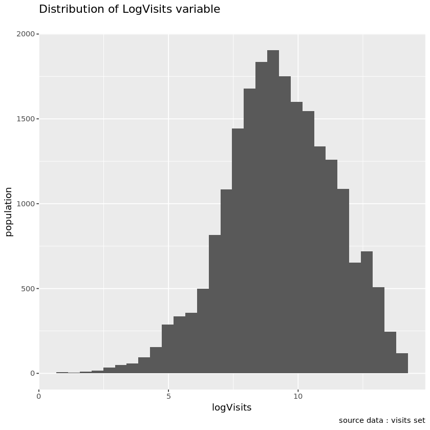


```R
#Checking normality
```


```R
qqnorm(visits$logVisits);qqline(visits$logVisits)
```


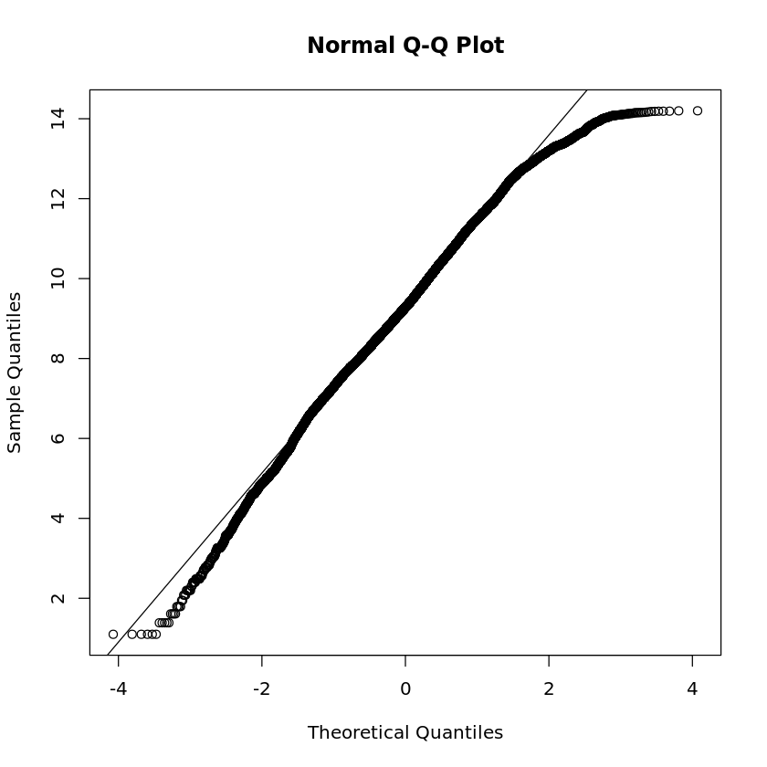


```R
plot(ecdf(visits$logVisits))
```


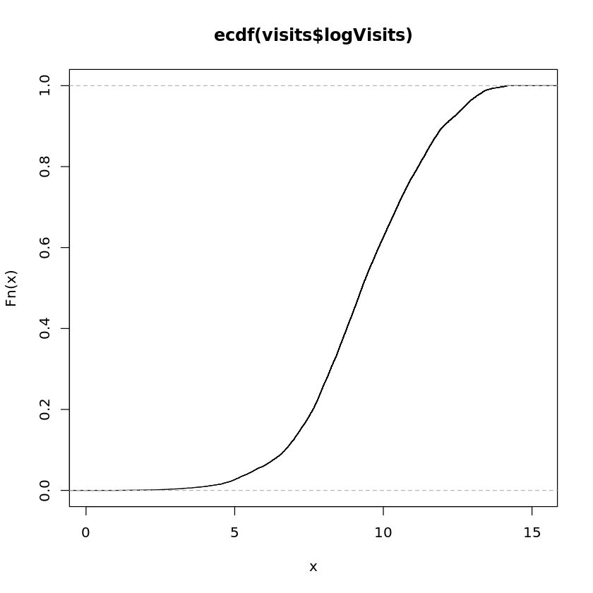


```R
# 10 Most visited park
```


```R
visits %>% group_by(ParkName) %>%
  summarize(n = sum(logVisits)) %>%
  top_n(10, ) %>%
  ggplot(aes(x=reorder(ParkName,n,desc) , y=n)) +
  geom_bar(stat='identity')  +
  labs(x="", y="") +
  theme(axis.text.x=element_text(angle=90,hjust=1,vjust=0.5))#+
  #geom_text(aes(label= n), hjust=-0.1, size=3) 
  #labs(title="Top 20 movies title based \n on number of ratings" , caption = "source data: edx set")
```

    Selecting by n


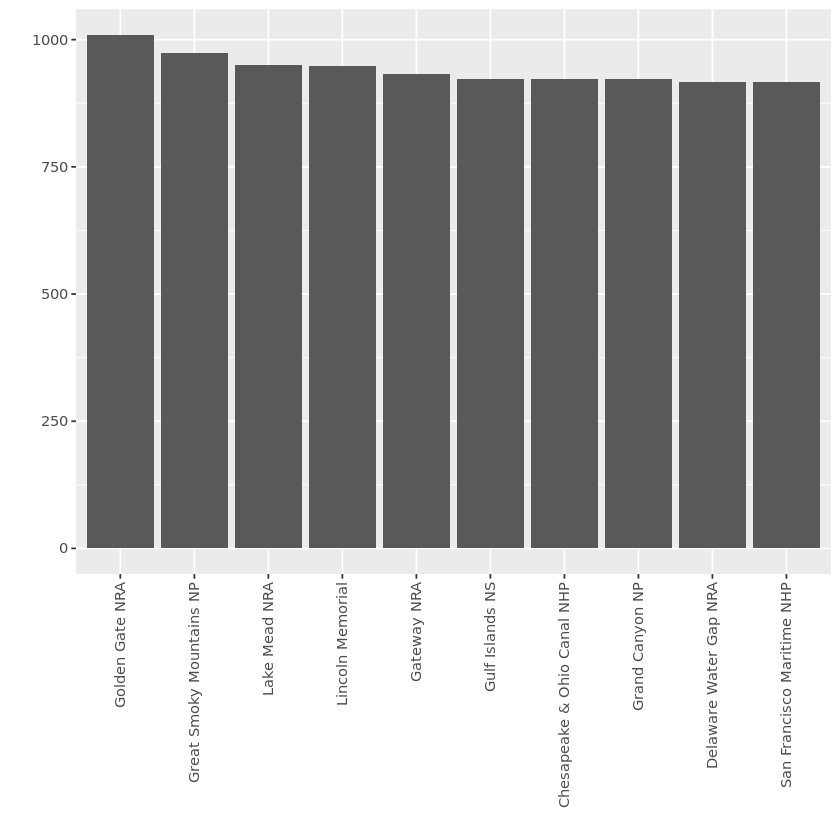


```R
#Most visited parkType
```


```R
visits %>% group_by(ParkType) %>%
  summarize(n = sum(logVisits)) %>%
  ggplot(aes(x=reorder(ParkType,n,desc) , y=n)) +
  geom_bar(stat='identity')  +
  labs(x="", y="") +
  theme(axis.text.x=element_text(angle=90,hjust=1,vjust=0.5))#+
  #geom_text(aes(label= n), hjust=-0.1, size=3) 
  #labs(title="Top 20 movies title based \n on number of ratings" , caption = "source data: edx set")
```


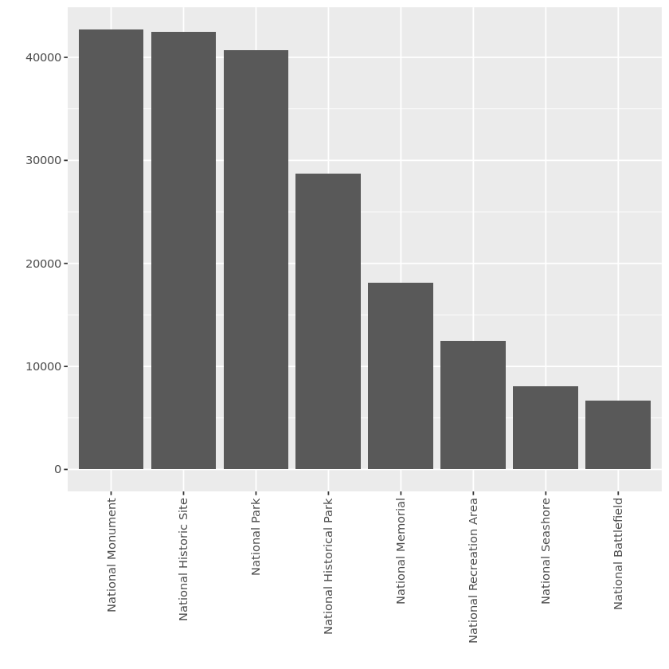


```R
# Most visited region
```


```R
visits %>% group_by(Region) %>%
  summarize(n = sum(logVisits)) %>%
  ggplot(aes(x=reorder(Region,n,desc) , y=n)) +
  geom_bar(stat='identity')  +
  labs(x="", y="") +
  theme(axis.text.x=element_text(angle=90,hjust=1,vjust=0.5))
```


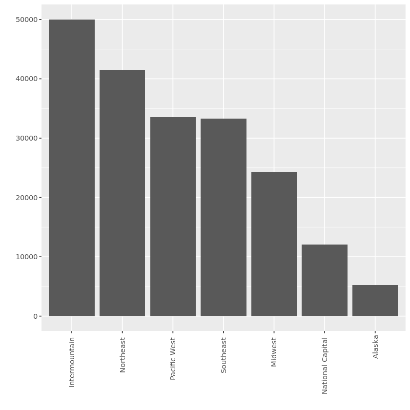


```R
## 20 Most visited state
```


```R
visits %>% group_by(State) %>%
  summarize(n = sum(logVisits)) %>%
  top_n(20,) %>%
  ggplot(aes(x=reorder(State,n,desc) , y=n)) +
  geom_bar(stat='identity')  +
  labs(x="", y="") +
  theme(axis.text.x=element_text(angle=90,hjust=1,vjust=2.5))
```

    Selecting by n


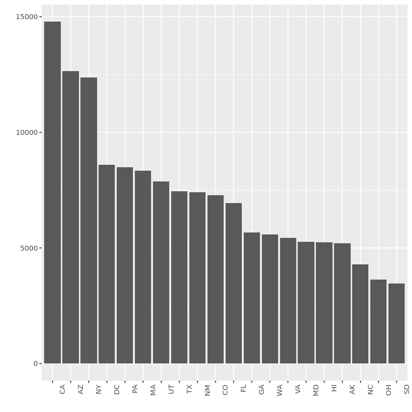


```R
#Most frequents months
```


```R
visits %>% group_by(Month) %>%
  summarize(n = sum(logVisits)) %>%
  ggplot(aes(x=reorder(Month,n,desc) , y=n)) +
  geom_bar(stat='identity')  +
  labs(x="", y="")# +
  #theme(axis.text.x=element_text(angle=90,hjust=1,vjust=2.5))
```


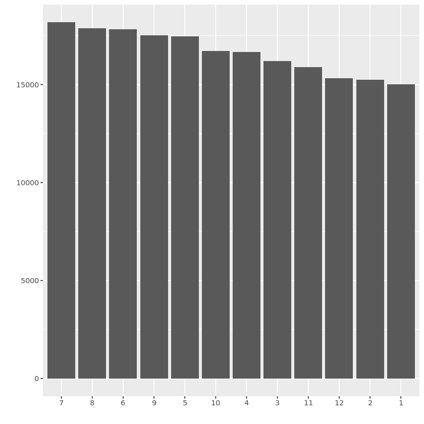


```R
##Year with the most  visits
```


```R
visits %>% group_by(Year) %>%
  summarize(n = sum(logVisits)) %>%
  ggplot(aes(x=reorder(Year,n,desc) , y=n)) +
  geom_bar(stat='identity')  +
  labs(x="", y="")# +
  #theme(axis.text.x=element_text(angle=90,hjust=1,vjust=2.5))
```


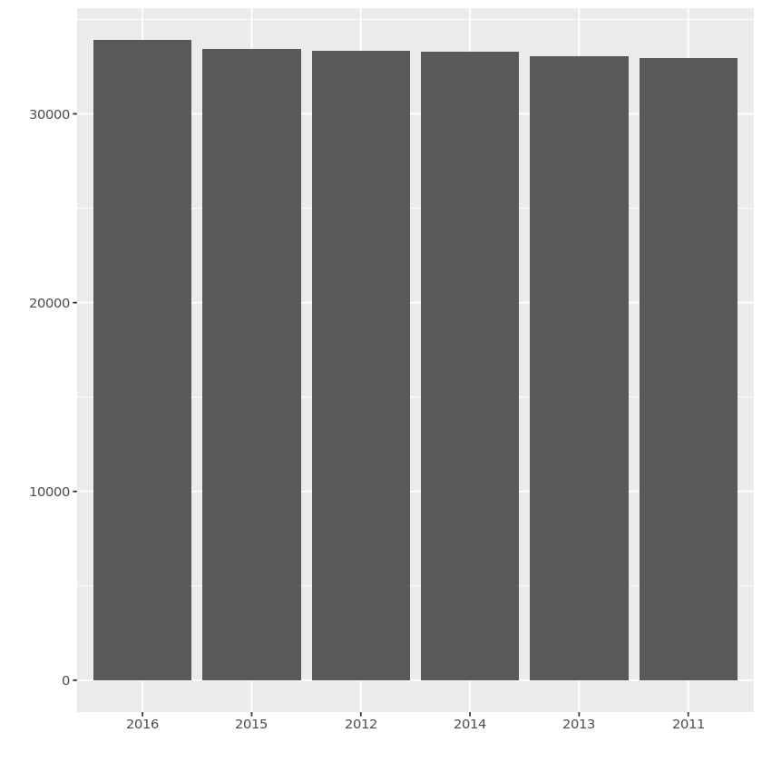


```R
#Let's go in detail in the interesting categorical variable ParkType to analyze visits in each type of park
```


```R
ggplot(data = visits, aes(x=ParkType, y=logVisits)) + geom_boxplot() + theme(axis.text.x=element_text(angle=90,hjust=1,vjust=2.5))
```


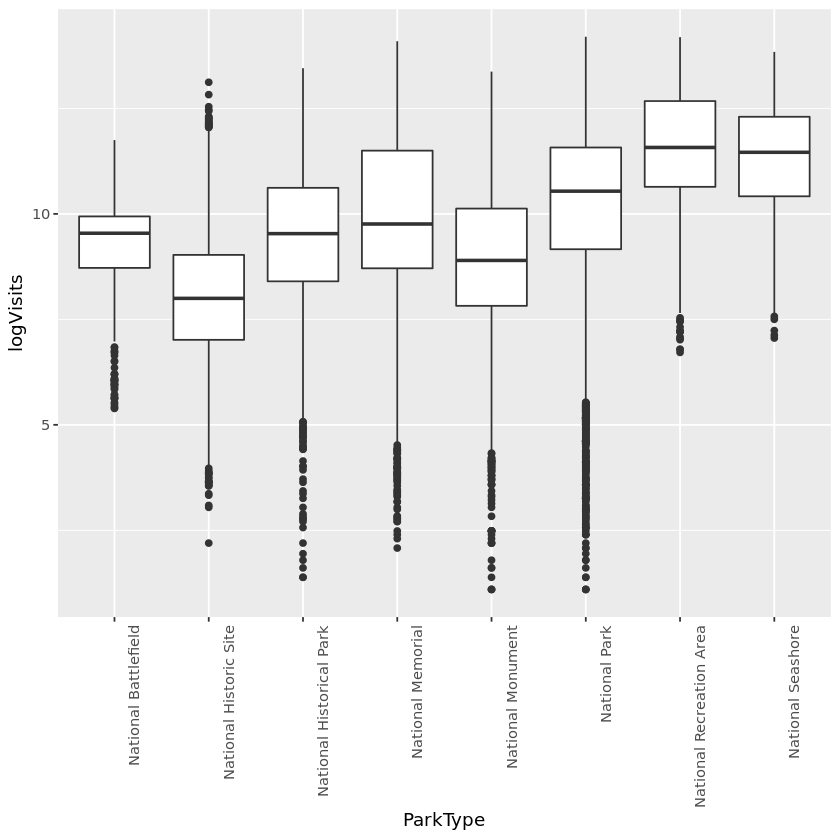


```R
#Numerical relationship between logVisits and Cost
```


```R
cor(visits$logVisits, visits$cost)
```


0.358364241498407


```R
#There is a positive correlation between logVisits and cost, which could mean higher cost has fewer influence on frequentations
# likely because more expensive parks are often more popular due to other features of the parks
```


```R
# Time serie analysis
```


```R
ts=ts(visits$logVisits,start=c(2010,1),freq=12)
```


```R
# Seasonal decomposition
```


```R
fit <- stl(ts, s.window="period")
plot(fit)
```


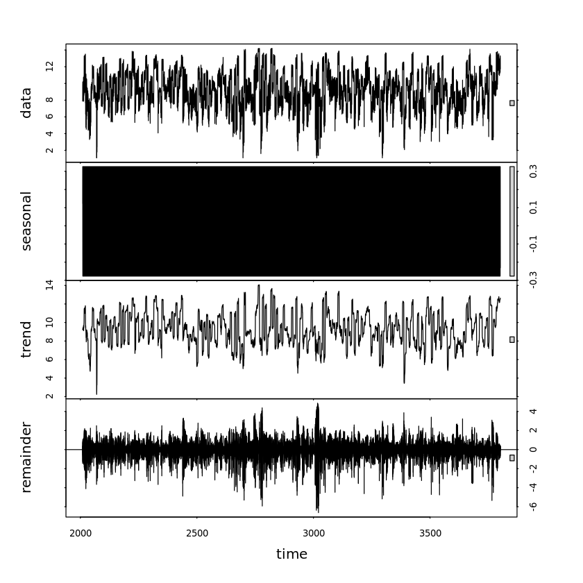


```R
# Data splipting
```


```R
#We are interested in predicting the log visits, let’s subset our dataset into a training and a testing set 
#by splitting based on the year: 
# training would contain 2010-2014 years of data, 
# and testing would be 2015-2016 data.

```


```R
training = subset(visits, Year >= 2010 & Year <= 2014)
dim(training)
```


<ol class=list-inline>
	<li>14338</li>
	<li>12</li>
</ol>


```R
testing = subset(visits, Year >= 2015 & Year <= 2016)
dim(testing)
```


<ol class=list-inline>
	<li>7162</li>
	<li>12</li>
</ol>


```R
# Let's start by a simple linear model
# we will use those independants variable
# laglogVisits, laglogVisitsYear, Year, Month, Region, ParkType, and cost
```


```R
visitsLM = lm(logVisits ~ laglogVisits + laglogVisitsYear + Year + Month + Region + ParkType + cost, data = training)
summary(visitsLM)
```


    
    Call:
    lm(formula = logVisits ~ laglogVisits + laglogVisitsYear + Year + 
        Month + Region + ParkType + cost, data = training)
    
    Residuals:
        Min      1Q  Median      3Q     Max 
    -5.9725 -0.2210 -0.0020  0.2079  9.4341 
    
    Coefficients:
                                       Estimate Std. Error t value Pr(>|t|)    
    (Intercept)                      -5.7680775  8.6949715  -0.663 0.507097    
    laglogVisits                      0.5027913  0.0051052  98.485  < 2e-16 ***
    laglogVisitsYear                  0.4106751  0.0048173  85.251  < 2e-16 ***
    Year                              0.0031569  0.0043206   0.731 0.464994    
    Month2                            0.1159852  0.0237187   4.890 1.02e-06 ***
    Month3                            0.3534700  0.0238852  14.799  < 2e-16 ***
    Month4                            0.2538986  0.0238456  10.648  < 2e-16 ***
    Month5                            0.3888252  0.0239772  16.216  < 2e-16 ***
    Month6                            0.2753548  0.0240065  11.470  < 2e-16 ***
    Month7                            0.2585186  0.0241000  10.727  < 2e-16 ***
    Month8                            0.0717295  0.0240819   2.979 0.002901 ** 
    Month9                            0.0193276  0.0239826   0.806 0.420314    
    Month10                          -0.1132568  0.0239405  -4.731 2.26e-06 ***
    Month11                          -0.1116565  0.0238207  -4.687 2.79e-06 ***
    Month12                          -0.0670265  0.0237596  -2.821 0.004794 ** 
    RegionIntermountain              -0.0423104  0.0311187  -1.360 0.173964    
    RegionMidwest                    -0.0376482  0.0318423  -1.182 0.237094    
    RegionNational Capital            0.2100051  0.0393440   5.338 9.56e-08 ***
    RegionNortheast                   0.1067349  0.0318246   3.354 0.000799 ***
    RegionPacific West                0.0540633  0.0314565   1.719 0.085696 .  
    RegionSoutheast                   0.0720603  0.0320214   2.250 0.024440 *  
    ParkTypeNational Historic Site   -0.0424715  0.0286264  -1.484 0.137925    
    ParkTypeNational Historical Park  0.0822116  0.0299409   2.746 0.006044 ** 
    ParkTypeNational Memorial         0.1554981  0.0315541   4.928 8.40e-07 ***
    ParkTypeNational Monument         0.0701139  0.0295025   2.377 0.017489 *  
    ParkTypeNational Park             0.1289505  0.0312339   4.129 3.67e-05 ***
    ParkTypeNational Recreation Area  0.2243614  0.0360719   6.220 5.11e-10 ***
    ParkTypeNational Seashore         0.1516997  0.0382825   3.963 7.45e-05 ***
    cost                              0.0053496  0.0008207   6.519 7.33e-11 ***
    ---
    Signif. codes:  0 ‘***’ 0.001 ‘**’ 0.01 ‘*’ 0.05 ‘.’ 0.1 ‘ ’ 1
    
    Residual standard error: 0.5775 on 14309 degrees of freedom
    Multiple R-squared:  0.9249,	Adjusted R-squared:  0.9248 
    F-statistic:  6298 on 28 and 14309 DF,  p-value: < 2.2e-16


```R
# Predict test data
# we will metrics R square to evlauate our models
```


```R
 LM.pred = predict(visitsLM, newdata=testing)
 LM.sse = sum((LM.pred - testing$logVisits)^2)
 LM.ssm = sum((LM.pred - mean(training$logVisits)) ^ 2) 

 R2.LM =  1 - LM.sse / LM.ssm
 print(R2.LM)
```

    [1] 0.9411129


```R
# Residuals plot
```


```R
hist((LM.pred - testing$logVisits),breaks = 50)
```


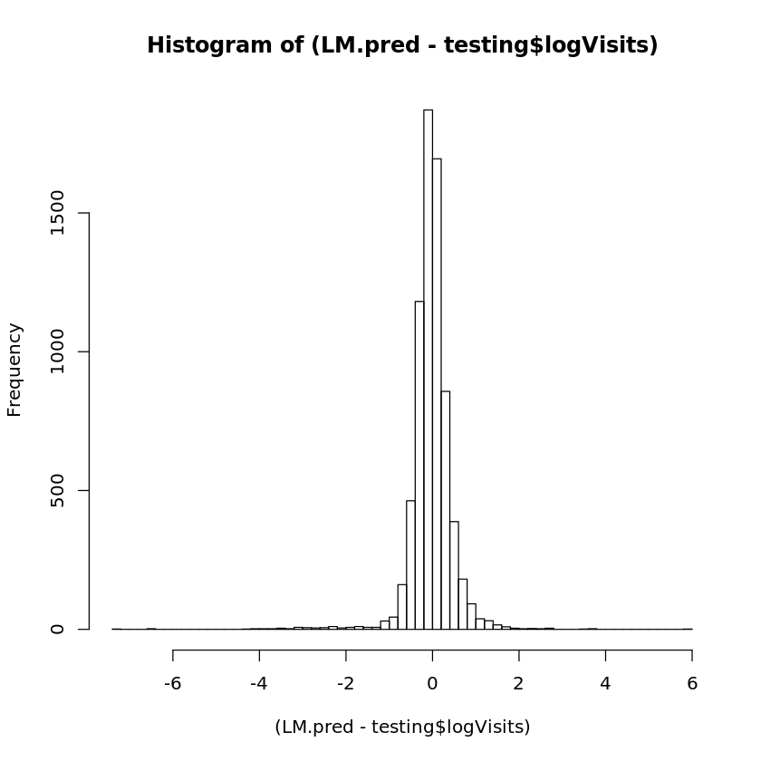


```R
# In addition to the logistic regression model, we can also train a regression tree. 
# Use the same set of variables as the previous problem 
# (laglogVisits, laglogVisitsYear, Year, Month, Region, ParkType, and cost), train a regression tree with cp = 0.05
```


```R
install.packages("rpart.plot")
```

    Installing package into ‘/srv/rlibs’
    (as ‘lib’ is unspecified)


```R
library(rpart)
library(rpart.plot)
```


```R
visitsTree = rpart(logVisits ~ laglogVisits + laglogVisitsYear + Year + Month + Region + ParkType + cost, data = training, cp=0.05)
prp(visitsTree)

```


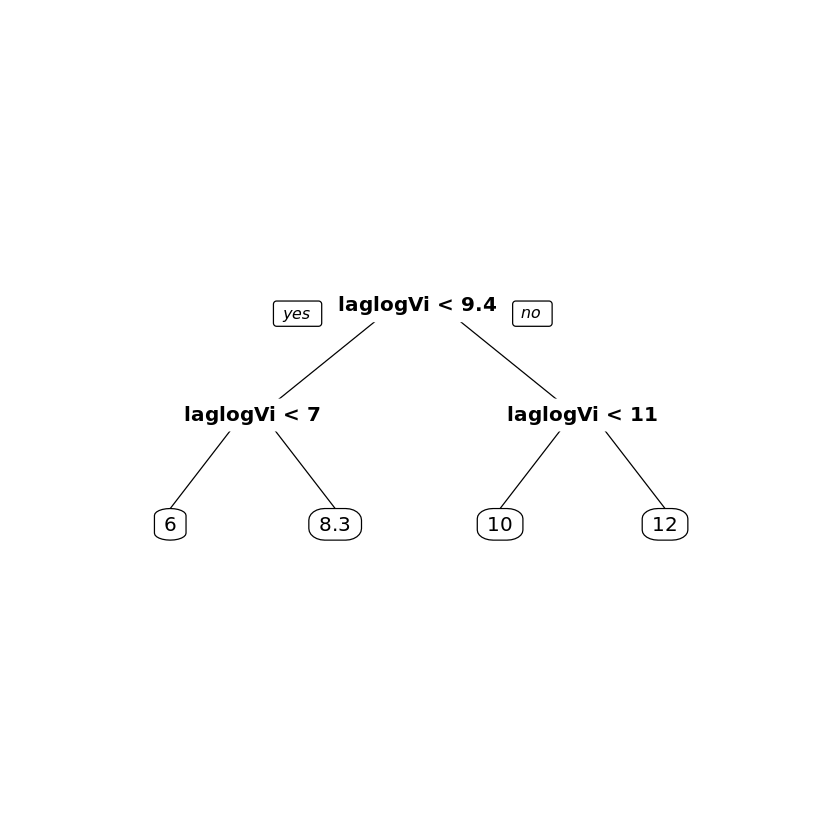


```R
# Evaluate Regression tree on test data set
```


```R
tree.pred = predict(visitsTree, newdata=testing)
tree.sse = sum((tree.pred - testing$logVisits)^2)
tree.ssm = sum((tree.pred - mean(training$logVisits))^2) 

R2.tree = 1 - tree.sse / tree.ssm
print(R2.tree)
```

    [1] 0.8326104


```R
# Tree model performs less well than linear regession
# let's use tree with cross validation
```


```R
install.packages("caret")
library(caret)
install.packages("e1071")
library(e1071)
```

    Installing package into ‘/srv/rlibs’
    (as ‘lib’ is unspecified)
    Installing package into ‘/srv/rlibs’
    (as ‘lib’ is unspecified)


```R
 set.seed(201)
 tr.control = trainControl(method = "cv", number = 10)
 numFolds = trainControl( method = "cv", number = 10 )
 cpGrid = expand.grid( .cp = seq(0.0001,0.005,0.0001)) 
 train(logVisits ~ laglogVisits + laglogVisitsYear + Year + Month + Region + ParkType + cost, data = training, method = "rpart", trControl = numFolds, tuneGrid = cpGrid )
```


    CART 
    
    14338 samples
        7 predictor
    
    No pre-processing
    Resampling: Cross-Validated (10 fold) 
    Summary of sample sizes: 12906, 12905, 12903, 12904, 12903, 12905, ... 
    Resampling results across tuning parameters:
    
      cp      RMSE       Rsquared   MAE      
      0.0001  0.4838971  0.9467770  0.2952133
      0.0002  0.4924362  0.9448958  0.3032523
      0.0003  0.4976597  0.9437303  0.3074828
      0.0004  0.5075856  0.9415064  0.3175902
      0.0005  0.5090270  0.9411936  0.3191110
      0.0006  0.5139388  0.9400830  0.3233982
      0.0007  0.5194519  0.9387892  0.3274553
      0.0008  0.5198011  0.9387014  0.3279586
      0.0009  0.5190786  0.9388980  0.3277833
      0.0010  0.5190786  0.9388980  0.3277833
      0.0011  0.5190786  0.9388980  0.3277833
      0.0012  0.5218088  0.9382561  0.3295830
      0.0013  0.5271344  0.9368804  0.3333222
      0.0014  0.5313146  0.9359253  0.3379208
      0.0015  0.5357965  0.9349171  0.3431950
      0.0016  0.5416167  0.9334610  0.3508861
      0.0017  0.5461812  0.9323744  0.3569955
      0.0018  0.5537915  0.9303121  0.3620179
      0.0019  0.5550574  0.9300059  0.3631031
      0.0020  0.5550087  0.9300239  0.3634760
      0.0021  0.5606959  0.9286402  0.3712965
      0.0022  0.5639396  0.9278474  0.3720488
      0.0023  0.5649483  0.9275849  0.3730385
      0.0024  0.5695213  0.9264489  0.3760930
      0.0025  0.5750305  0.9250698  0.3823049
      0.0026  0.5814986  0.9234595  0.3866928
      0.0027  0.5839201  0.9228570  0.3896643
      0.0028  0.5845562  0.9226606  0.3911005
      0.0029  0.5867111  0.9220863  0.3925992
      0.0030  0.5905840  0.9210462  0.3977341
      0.0031  0.5922378  0.9206193  0.3996227
      0.0032  0.5932963  0.9203172  0.4009069
      0.0033  0.5964782  0.9193833  0.4058073
      0.0034  0.5977599  0.9190425  0.4074945
      0.0035  0.5992522  0.9186577  0.4091447
      0.0036  0.6011586  0.9181622  0.4107840
      0.0037  0.6011586  0.9181622  0.4107840
      0.0038  0.6011586  0.9181622  0.4107840
      0.0039  0.6011586  0.9181622  0.4107840
      0.0040  0.6011586  0.9181622  0.4107840
      0.0041  0.6011586  0.9181622  0.4107840
      0.0042  0.6011586  0.9181622  0.4107840
      0.0043  0.6011586  0.9181622  0.4107840
      0.0044  0.6025489  0.9177978  0.4120021
      0.0045  0.6041986  0.9173678  0.4133392
      0.0046  0.6041986  0.9173678  0.4133392
      0.0047  0.6041986  0.9173678  0.4133392
      0.0048  0.6062630  0.9168683  0.4147676
      0.0049  0.6062630  0.9168683  0.4147676
      0.0050  0.6062630  0.9168683  0.4147676
    
    RMSE was used to select the optimal model using the smallest value.
    The final value used for the model was cp = 1e-04.


```R
#Final Regression Tree
#let's re-run the regression tree on the training data, 
#now using the cp value equal to the one selected in the previous problem cp = 1e-04.

```


```R
visitsTree = rpart(logVisits ~ laglogVisits + laglogVisitsYear + Year + Month + Region + ParkType + cost, data = training, cp = 1e-04)
```


```R
# Let's evaluate tree model with cross validation
```


```R
tree.pred2 = predict(visitsTree, newdata=testing)
tree.sse = sum((tree.pred - testing$logVisits)^2)
tree.sse = sum((tree.pred2 - testing$logVisits)^2)
tree.ssm = sum((testing$logVisits - mean(training$logVisits))^2)
R2.tree = 1 - tree.sse / tree.ssm
print(R2.tree)
```

    [1] 0.960693


```R
# big improvement noticed
```


```R
#Random Forest
#We can potentially further improve the models by using a random forest.
# we train a random forest model with the same set of covariates, 
# and using just default parameters 
#This may take a few minutes.

```


```R
install.packages("randomForest")
library(randomForest)
```

    Installing package into ‘/srv/rlibs’
    (as ‘lib’ is unspecified)
    randomForest 4.6-14
    Type rfNews() to see new features/changes/bug fixes.
    
    Attaching package: ‘randomForest’
    
    The following object is masked from ‘package:dplyr’:
    
        combine
    
    The following object is masked from ‘package:ggplot2’:
    
        margin
    


```R
#Model building and evaluated
```


```R
set.seed(201)
RandonForest = randomForest(logVisits ~ laglogVisits + laglogVisitsYear + Year + Month + Region + ParkType + cost, data = training) 
Forest.pred3 = predict(RandonForest, newdata=testing)
Forest.sse = sum((Forest.pred3 - testing$logVisits)^2)
#Forest.ssm = sum((testing$logVisits - mean(visits$logVisits))^2)
Forest.ssm = sum((Forest.pred3 - mean(training$logVisits))^2)
R2.Forest = 1 - Forest.sse / Forest.ssm
print(R2.Forest)
```

    [1] 0.969775


```R
# new improvements noticed
```
